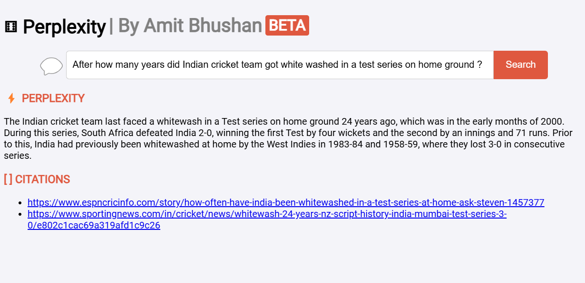

## Live Link: https://mini-perplexity-qna.vercel.app/

> **Note**: The backend for this app is hosted on [Render](https://dashboard.render.com/). Since the backend runs on a free-tier account (without credit card verification), the first query may take 2-3 minutes to start up the instance. Subsequent queries will process more quickly.


# Mini Perplexity Q&A System

This project is a Mini Perplexity Q&A System, featuring a FastAPI backend and React frontend to provide answers to user queries. It uses Bing Search API for web data and OpenAI LLMs for response generation, offering search results and GPT-powered answers. Below are setup, deployment, and usage instructions.

## Table of Contents

- [Overview](#overview)
- [Setup and Installation](#setup-and-installation)
- [Deployment](#deployment)
- [Usage](#usage-instructions)
- [Design Decisions and Challenges](#design-decisions-and-challenges)
- [Future Improvements](#future-improvements)

---

## Overview

This system aims to answer user questions using the Bing Search API to retrieve relevant web information and GPT-4 to generate responses. The backend fetches, processes, and passes the data to the frontend, which provides an interface for user interaction.

## Setup and Installation

### Prerequisites

- Python 3.7+
- Node.js and npm
- API keys for Bing Search and OpenAI

### Backend (FastAPI)

1. **Clone the repository:**

   ```bash
   git clone <repository_url>
   cd mini_perplexity_qna
   ```

2. **Navigate to the backend directory:**

   ```bash
   cd backend
   ```

3. **Create a virtual environment and activate it:**

   ```bash
   python -m venv venv
   ```

   - **For MacOS/Linux:**
     ```bash
     source venv/bin/activate
     ```

   - **For Windows:**
     ```bash
     venv\Scripts\activate
     ```

4. **Install dependencies:**

   ```bash
   pip install -r requirements.txt
   ```

5. **Configure environment variables in `.env`:**

   ```plaintext
   BING_SEARCH_API_KEY=your_bing_api_key
   OPENAI_API_KEY=your_openai_api_key
   ```

6. **Start the FastAPI backend:**

   ```bash
   uvicorn app.main:app --reload
   ```

### Frontend (React)

1. **Navigate to the frontend directory:**

   ```bash
   cd ../frontend
   ```

2. **Install dependencies:**

   ```bash
   npm install
   ```

3. **Set the backend API endpoint in the frontend configuration (e.g., `.env` or configuration file).**

4. **Start the React frontend:**

   ```bash
   npm start
   ```

## Deployment

### Backend Deployment on Render

1. Create a **Render** account and link your GitHub repository.
2. Set the `\backend` folder as the root directory of the monorepo.
3. Specify the build command as `pip install -r requirements.txt` and the start command as `uvicorn app.main:app --host 0.0.0.0 --port 8000` in the settings.
4. Add your API keys as environment variables, using `OPENAI_API_KEY` and `BING_SEARCH_API_KEY` as the key names.

### Frontend Deployment on Vercel

1. Create a **Vercel** account and link your GitHub repository.
2. Deploy the frontend service from the repository.
3. Ensure that the backend API endpoint is correctly configured in the environment settings.


## Usage Instructions

1. **Setup**: Choose one of the following options to set up the application:
   - **Local Deployment**: Clone the repository and follow the setup instructions in the README file.
   - **Cloud Deployment**: Deploy the application using your preferred cloud service provider or as hinted above.
   - **Access Deployed Version**: Use the provided [link](https://mini-perplexity-qna.vercel.app/) to access the application that is already deployed.

2. **Open Application**: Launch your preferred web browser and navigate to the frontend URL.

3. **Enter Your Query**: In the search box, type your question or query and press **Enter**.

4. **View Results**: Examine the response generated by GPT-4, along with citations sourced from Bing, displayed in the results area.


## Application Screenshot




## Design Decisions and Challenges

- **Search API Choice**: We chose **Bing Search API v7** for its reliable search capabilities, ease of integration, and accessible free-tier API keys, providing accurate results well-suited to our project requirements.

- **LLM Choice**: We chose the **OpenAI GPT-4o Mini model** for its low cost and excellent performance, making it ideal for beta builds.

- **Backend Choice**: We chose **FastAPI** for its high performance and asynchronous support, making it ideal for building fast, scalable APIs with minimal code.

- **Search Result Processing**: We extract the **top two** results from search results and generate answers using their snippets and main content to ensure relevant and concise responses.

- **Content Extraction**: Simply not depending on just snippet, we used **BeautifulSoup** to fetch and process relevant text from sources, enhancing accuracy.

- **Frontend Choice**: We chose **React** for the frontend due to its component-based architecture, enabling efficient rendering and a responsive user experience.

- **Frontend Deployment**: **Vercel** was selected for frontend deployment due to its easy integration with GitHub, allowing quick builds for changes and providing free HTTPS sharable URLs.

- **UI/UX Design Choice**: The color scheme and design are inspired by **Perplexity's UI from 2022**, reflecting their aesthetic as seen in historical [tweets](https://x.com/perplexity_ai/status/1600551871554338816).

- **Backend Deployment**: We deployed the backend on **Render** for the required compute at no cost, providing the fastest path to production.


## Future Improvements

1. **Dedicated Prompts for Different Scenarios**: Implement specific prompts for tailored responses, allowing context-specific answers like code snippets or brief explanations.

2. **Improved Chat History Utilization**: Enhance chat history handling to provide contextually relevant responses, summarizing past interactions for follow-up queries.

3. **Dynamic Formatting Options**: Allow users to request answers in various formats (e.g., markdown, plain text) to improve clarity and usability.

4. **User Profiles and Preferences**: Introduce user profiles to remember individual preferences for response types and tones, fostering a personalized experience.

5. **Feedback Loop**: Establish a feedback mechanism for users to evaluate responses, enabling continuous improvement of the assistant's accuracy and relevance.

6. **Multi-Modal Capabilities**: Incorporate multimedia support (images, videos) in responses to enrich user experience, especially in visual or tutorial contexts.

7. **Caching**: Integrate a caching system to improve response times for frequently asked queries, enhancing overall efficiency.

8. **Expanded API Options**: Add support for additional search APIs or AI models, increasing the range of information and insights provided to users.


---

For any questions, please feel free to reach out.
